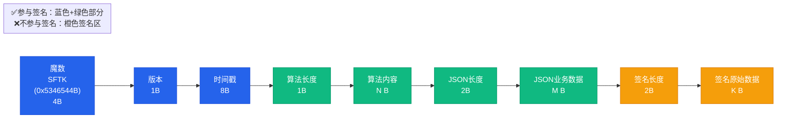

```mermaid
flowchart LR
    subgraph NOTE["✅参与签名：蓝色+绿色部分<br/>❌不参与签名：橙色签名区"]
    end
    A["魔数<br/>SFTK<br/>(0x5346544B)<br/>4B"]:::blue
    B["版本<br/>1B"]:::blue
    C["时间戳<br/>8B"]:::blue
    D["算法长度<br/>1B"]:::green
    E["算法内容<br/>N B"]:::green
    F["JSON长度<br/>2B"]:::green
    G["JSON业务数据<br/>M B"]:::green
    H["签名长度<br/>2B"]:::orange
    I["签名原始数据<br/>K B"]:::orange

    A --> B --> C --> D --> E --> F --> G --> H --> I

    classDef blue fill:#2563eb,color:white,stroke:#1d4ed8,rounded:4px
    classDef green fill:#10b981,color:white,stroke:#059669,rounded:4px
    classDef orange fill:#f59e0b,color:white,stroke:#d97706,rounded:4px
```